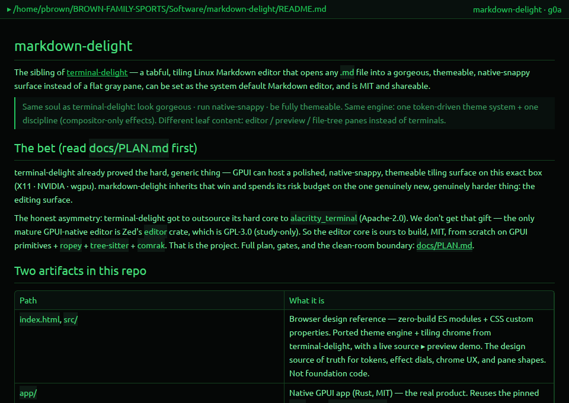

# markdown-delight

The sibling of **[terminal-delight](../terminal-delight)** — a **tabful, tiling Linux
Markdown editor** that opens any `.md` file into a **gorgeous, themeable, native-snappy
surface** instead of a flat gray pane, can be **set as the system default Markdown editor**,
and is **MIT and shareable**.

> Same soul as terminal-delight: *look gorgeous · run native-snappy · be fully themeable.*
> Same engine: one token-driven theme system + one discipline (compositor-only effects).
> Different leaf content: **editor / preview / file-tree** panes instead of terminals.

## The bet (read `docs/PLAN.md` first)

terminal-delight already proved the hard, generic thing — *GPUI can host a polished,
native-snappy, themeable tiling surface on this exact box (X11 · NVIDIA · wgpu).*
markdown-delight **inherits that win** and spends its risk budget on the one genuinely new,
genuinely harder thing: **the editing surface.**

The honest asymmetry: terminal-delight got to outsource its hard core to `alacritty_terminal`
(Apache-2.0). **We don't get that gift** — the only mature GPUI-native editor is Zed's
`editor` crate, which is **GPL-3.0 (study-only)**. So the editor core is **ours to build,
MIT, from scratch** on GPUI primitives + `ropey` + `tree-sitter` + `comrak`. That is the
project. Full plan, gates, and the clean-room boundary: **[`docs/PLAN.md`](docs/PLAN.md)**.

## Two artifacts in this repo

| Path | What it is |
|---|---|
| `index.html`, `src/` | **Browser design reference** — zero-build ES modules + CSS custom properties. Ported theme engine + tiling chrome from terminal-delight, with a **live source ▸ preview demo**. The design source of truth for tokens, effect dials, chrome UX, and pane shapes. **Not foundation code.** |
| `app/` | **Native GPUI app** (Rust, MIT) — the real product. Reuses the pinned `gpui` from `../zed-upstream`. Currently at the **G0a substrate spike**. |

## Run the design reference

```bash
npm run dev          # python3 -m http.server 4323  (zero deps)
```
Open <http://localhost:4323>. Deep-link a theme: `?theme=tactical-overdrive&seed=%2331d7ff`.

No build step. Pure ES modules + CSS custom properties.

## Run the native spike

```bash
cd app
cargo run            # opens a GPUI window, renders a .md file's text in the hacker palette
cargo run -- README.md
```
Requires the sibling `../zed-upstream` checkout (the pinned `gpui` source). See
`app/Cargo.toml`.

## What works today

| | Status |
|---|---|
| Browser reference: 4 themes × seed colour, effect dial, UI scale | ✅ ported |
| Browser reference: tabs · split-right/down · draggable splitters · detach | ✅ ported |
| Browser reference: **live source ▸ Markdown preview** (edit left, render right) | ✅ |
| Native: GPUI window opens any `.md` (G0a) | ✅ |
| Native: **rendered Markdown** — comrak AST → GPUI elements, no webview (G0d) | ✅ |
| Registered as the system default `.md` handler (right-click → opens us) | ✅ on this box |
| Native: editor core (rope buffer, cursor, edit loop) — **G0b** | ⏭ next |



## Themes

Inherited from terminal-delight, same 3-tier engine (`src/styles/theme.css`):

1. **seed palette** — `theme-engine.js` runs a seed hex through HSL math → `--theme-*` vars.
2. **semantic tokens** — each `html[data-theme=…]` maps those to `--bg / --surface / --text / --accent …`.
3. **effect dial** — `--scanline-opacity / --glow-radius / --crt-vignette`. `hacker` maxes
   them; `quiet-command` zeroes them. **Same engine, different dial.**

`hacker` · `tactical-overdrive` · `field-command` · `quiet-command`.

## Roadmap (see `docs/PLAN.md` §3)

- **0.1** — two-pane editor: rope-backed syntax-highlighted source + live comrak preview, save, theme hot-reload.
- **0.2** — tabs · file-tree · session restore · atomic save + external-change detect · **set-as-default-handler** · packaging.
- **0.4** — **"Live Preview" hybrid** (Obsidian-style inline styling — the signature delight).
- **1.0** — big-file rigor, find/replace, multi-cursor, theme gallery.

## License

MIT.
</content>
