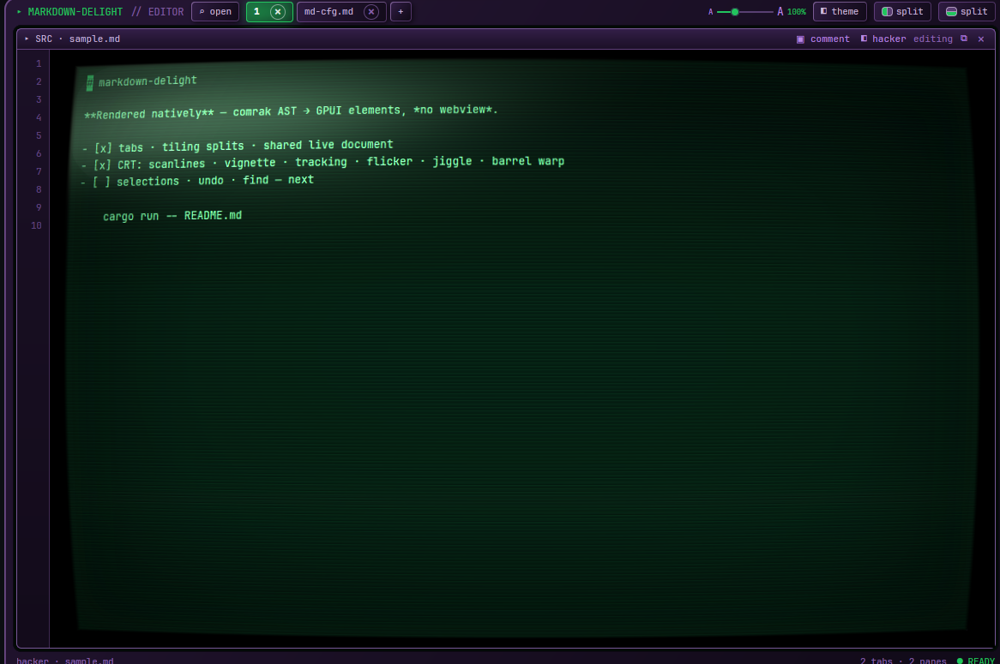
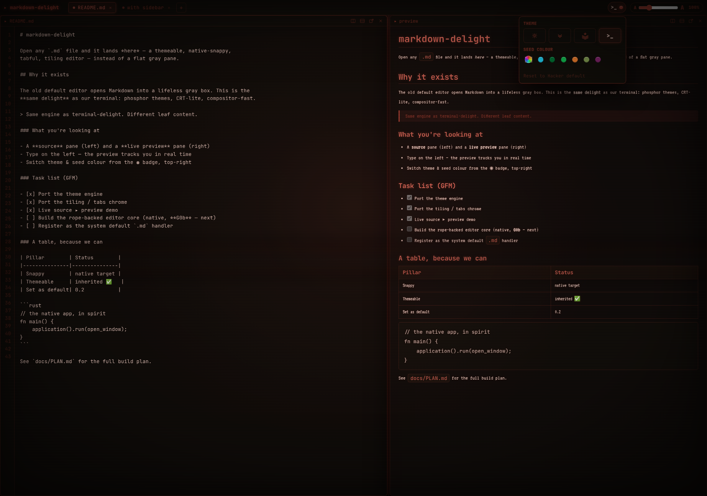

# markdown-delight

The sibling of **[terminal-delight](../terminal-delight)** — a **tabful, tiling Linux
Markdown editor** that opens any `.md` file into a **gorgeous, themeable, native-snappy
surface** instead of a flat gray pane, can be **set as the system default Markdown editor**,
and is **MIT and shareable**.

> Same soul as terminal-delight: *look gorgeous · run native-snappy · be fully themeable.*
> Same engine: one token-driven theme system + one discipline (compositor-only effects).
> Different leaf content: **editor / preview / file-tree** panes instead of terminals.

**[Website](https://markdown-delight.brownfamilysports.com)** ·
**[v0.1.0 release](https://github.com/parker-brown-family/markdown-delight/releases/tag/v0.1.0)** ·
MIT (source + binary) · Linux · AppImage

## Download

The shipped binary is a **self-contained MIT AppImage** — we sever the GPL crates
the Zed/gpui graph would otherwise link (`patches/sever-gpl-crates.patch`, applied
by `scripts/prepare-gpui.sh`), so there's no GPL boundary on what you run. Grab the
latest release and go:

```bash
curl -fL -o markdown-delight.AppImage \
  https://github.com/parker-brown-family/markdown-delight/releases/latest/download/markdown-delight-x86_64.AppImage
chmod +x markdown-delight.AppImage
./markdown-delight.AppImage
```

Needs **glibc ≥ 2.35** (Ubuntu 22.04+ / Debian 12+) and a working host
GPU/Vulkan stack — the AppImage bundles the app, **not** your graphics drivers.
Prefer to build it yourself? See [Build the native app](#build-the-native-app).

## The bet (read `docs/PLAN.md` first)

terminal-delight already proved the hard, generic thing — *GPUI can host a polished,
native-snappy, themeable tiling surface on this exact box (X11 · NVIDIA · wgpu).*
markdown-delight **inherits that win** and spends its risk budget on the one genuinely new,
genuinely harder thing: **the editing surface.**

The honest asymmetry: terminal-delight got to outsource its hard core to `alacritty_terminal`
(Apache-2.0). **We don't get that gift** — the only mature GPUI-native editor is Zed's
`editor` crate, which is **GPL-3.0 (study-only)**. So the editor core is **ours to build,
MIT, from scratch** on GPUI primitives + `ropey` + `tree-sitter` + `comrak`. That is the
project. Full plan, gates, and the clean-room boundary: **[`docs/PLAN.md`](docs/PLAN.md)**.

## Two artifacts in this repo

| Path | What it is |
|---|---|
| `prototype.html`, `src/` | **Browser design reference** — zero-build ES modules + CSS custom properties. Ported theme engine + tiling chrome from terminal-delight, with a **live source ▸ preview demo**. The design source of truth for tokens, effect dials, chrome UX, and pane shapes. **Not foundation code.** (`index.html` is the GitHub Pages landing page.) |
| `app/` | **Native GPUI app** (Rust, MIT) — the real product. Reuses the pinned `gpui` from `../zed-upstream`. Edit-by-default, tabs, tiling splits, pane drag-and-drop, per-pane themes, `ctrl+p` finder, session restore, full text selection + clipboard, and **comment mode** (Google-Docs-style review). |

## Run the design reference

```bash
npm run dev          # python3 -m http.server 4323  (zero deps)
```
Open <http://localhost:4323/prototype.html> for the live source ▸ preview demo
(`/` serves the landing page). Deep-link a theme:
`?theme=tactical-overdrive&seed=%2331d7ff`.

No build step. Pure ES modules + CSS custom properties.

## Build the native app

> **Heads-up:** this is an early/WIP build, verified only on **Linux · X11 ·
> NVIDIA · wgpu (Vulkan)**. Wayland and AMD/Intel are expected to work but are
> unverified. Full prerequisites + troubleshooting: **[`BUILDING.md`](BUILDING.md)**.

The app consumes `gpui` from a **pinned Zed checkout** as a sibling directory
(path deps in `app/Cargo.toml`), carrying a small Apache-2.0-compatible render
patch (`td-crt-pass`, in [`patches/`](patches/)) for the per-pane CRT barrel warp:

```bash
# one-time: the pinned gpui source, beside this repo, at the exact pin + our patch
git clone https://github.com/zed-industries/zed ../zed-upstream
cd ../zed-upstream
git checkout abbe85a3321bf6cb7f5b241e623d9c2e16c29187
git apply ../markdown-delight/patches/td-crt-pass.patch
cd ../markdown-delight

cd app
cargo run -- ../README.md  # tabs · splits · edit-by-default · full CRT
cargo build --release
../scripts/make-default.sh  # become the system default .md handler (+icon)
```

See **[`BUILDING.md`](BUILDING.md)** for the full step-by-step, system
dependencies, and the directory layout the path-deps expect.

Keys: `ctrl+e` source↔preview · `ctrl+s` save · `ctrl+shift+s` save as… ·
`ctrl+shift+c` comment mode · `ctrl+shift+a` all-comments browser ·
`ctrl+alt+r`/`ctrl+alt+d` split right/down · `ctrl+shift+t` new tab ·
`ctrl+pgup/pgdn` switch tab · `alt+arrows` pane focus · `ctrl+w` close pane ·
right-click tab: rename. `ctrl+alt+m` (system hotkey) opens a fresh scratch pad.
Source mode has full text selection (Shift+arrows / word & doc motion) and
clipboard. Click places the cursor; the live theme file is
`~/.config/markdown-delight/theme.toml` (hot-reloads while running).

## What works today

| | Status |
|---|---|
| Browser reference: 4 themes × seed colour, effect dial, UI scale | ✅ ported |
| Browser reference: tabs · split-right/down · draggable splitters · detach | ✅ ported |
| Browser reference: **live source ▸ Markdown preview** (edit left, render right) | ✅ |
| Native: GPUI window opens any `.md` (G0a) | ✅ |
| Native: **rendered Markdown** — comrak AST → GPUI elements, no webview (G0d) | ✅ |
| Registered as the system default `.md` handler (right-click → opens us) | ✅ on this box |
| Native: **monitor-wrap CRT** — master frame, per-screen frames, scanlines, tracking, flicker, jiggle, barrel warp | ✅ |
| Native: hot-reload theme (`~/.config/markdown-delight/theme.toml`) | ✅ |
| Native: **EDITING** — Ctrl+E source mode (rope + cursor), Ctrl+S atomic save — **G0b PASSED** | ✅ |
| Native: **text selection + clipboard** — Shift/word/doc motion, cut/copy/paste, shift-click | ✅ |
| Native: tabs · tiling splits · pane drag-and-drop · notebooks · session restore | ✅ |
| Native: **comment mode** — Google-Docs-style block + range review, decay, all-comments browser, export | ✅ |
| Undo/redo · find · file-tree | ⏭ next |



## Themes — the IMT Field-Terminal CRT spec

Same 3-tier engine as terminal-delight (`src/styles/theme.css`), upgraded to the full
IMT PM Field-Terminal CRT spec:

1. **seed palette** — `theme-engine.js` runs a seed hex through HSL math → `--theme-*` vars.
   One hex reshapes the whole screen (the maroon shot below is `?seed=%23a04438`).
2. **semantic tokens** — each `html[data-theme=…]` maps those to `--bg / --surface / --text / --accent …`.
3. **effect dial — the CRT engine.** Two fixed, GPU-composited layers driven entirely by
   per-theme dials: **curved-monitor corner falloff** (vignette + inset corner shading),
   **center phosphor bloom**, **scanlines**, **slow flicker**, and the **rolling tracking
   band**. `hacker` runs the full tube (VT323 phosphor face, per-glyph glow);
   `tactical-overdrive` a cooler glass; `quiet-command` turns the screen off entirely.
   Firefox and `prefers-reduced-motion` automatically shed the costly animated layers.

App-bar theme menu (spec-faithful port of the IMT navbar): active-theme icon + live swatch
trigger · 4 icon themes with tooltips · seed-colour wheel + swatches with a Default badge ·
"Reset to … default" · `A ──● A %` UI-scale pill.



`hacker` · `tactical-overdrive` · `field-command` · `quiet-command`.

## Roadmap (see `docs/PLAN.md` §3)

- **0.1 — shipped** ✅ — two-pane editor (rope source + live comrak preview),
  atomic save, theme hot-reload, tabs/tiling/notebooks/session-restore, full
  text selection + clipboard, set-as-default-handler, and **comment mode**.
- **0.2** — undo/redo · find/replace · file-tree · external-change detect · range comments across blocks.
- **0.4** — **"Live Preview" hybrid** (Obsidian-style inline styling — the signature delight).
- **1.0** — big-file rigor, multi-cursor, theme gallery, comment export formats.

## License

MIT — see [`LICENSE`](LICENSE). Third-party attributions:
[`THIRD-PARTY-NOTICES.md`](THIRD-PARTY-NOTICES.md). Zed's GPL editor crates
are study-only and never linked (clean-room boundary, `docs/PLAN.md` §2).
</content>
